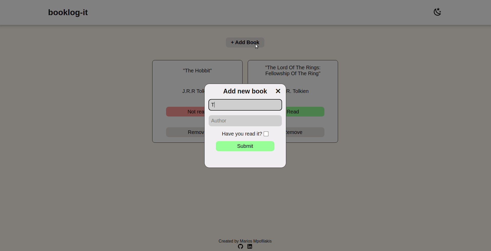
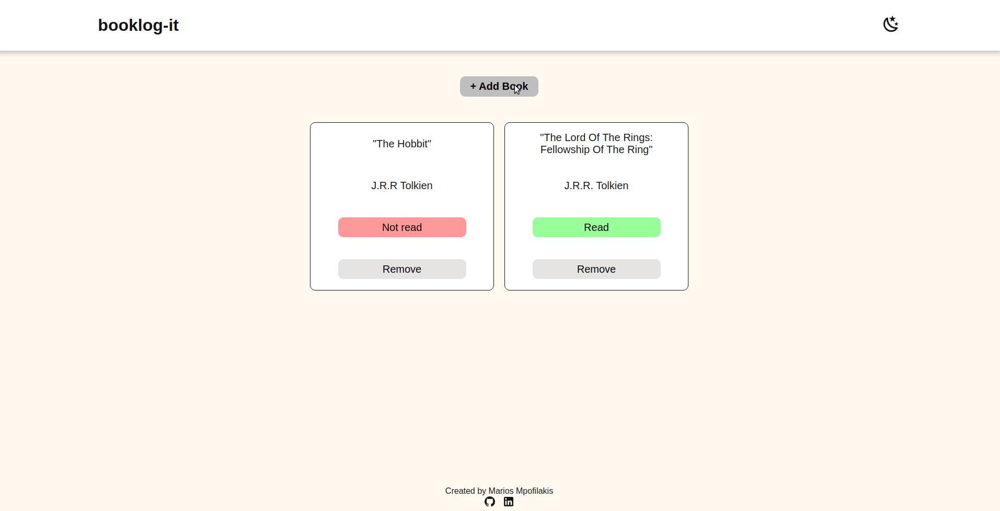

# booklog-it

A minimalist website to track your book backlog.

## Features

* The user can add a book to his backlog by pressing the add book button.
* The user needs to provide a title for the book, as well as the name of the author and specify wether or not they have read the book.
* The user can remove a book from their list by clicking the remove button
* A book's read status can be updated by clicking the Read/Not read button.
* booklog-it is available in light and dark mode, toggleable from the moon button in the header.

## Demo
### Adding and removing items

### Light and dark mode

## About

booklog-it is made using pure HTML5, CSS3 and Javascript (ES6). It demonstrates the use of the dialog tag as a way to create pop-up dialogues, the use of objects and object.prototype in relation to web development and the use of local storage as a way to create a persistent state for the webpage for each user.

This project was made as part of the [Odin Project curriculum](https://www.theodinproject.com/).
